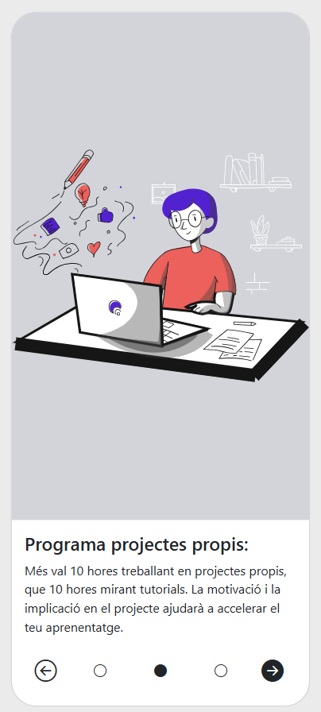

# IT-S5-Angular-OnBoarding

## 🗂️Tabla de contenidos

- [IT-S5-Angular-OnBoarding](#it-s5-angular-onboarding)
  - [🗂️Tabla de contenidos](#️tabla-de-contenidos)
  - [📄Descripción](#descripción)
    - [1. Mostrar texto del primer paso](#1-mostrar-texto-del-primer-paso)
    - [2. Añadir nuevos textos y mostrarlos en diferentes scenes](#2-añadir-nuevos-textos-y-mostrarlos-en-diferentes-scenes)
    - [3. Maquetación inicial responsive](#3-maquetación-inicial-responsive)
    - [4. Cambio de escena mediante botones](#4-cambio-de-escena-mediante-botones)
    - [5. Cambio de escena haciendo clic en las círculos](#5-cambio-de-escena-haciendo-clic-en-las-círculos)
    - [6. Animación entre cambio de step](#6-animación-entre-cambio-de-step)
  - [💻Tecnologías Utilizadas](#tecnologías-utilizadas)
  - [📋Requisitos](#requisitos)
  - [🛠️Instalación](#️instalación)
    - [1. Descargar el repositorio](#1-descargar-el-repositorio)
    - [2. Instalación de paquetes Node.js](#2-instalación-de-paquetes-nodejs)
  - [▶️Ejecución](#️ejecución)

## 📄Descripción

Aplicación web en Angular que muestre un tutorial con los pasos a seguir para un onBoarding.

Se dibujan tarjetas con la información de cada paso y se puede ir hacia delante y atrás en ellas.

### 1. Mostrar texto del primer paso

- Crear los componentes `Home` y `Scene`.
- Crear interfaz `iStep`
- Crear servicio `Steps`
- Mostrar texto en la primera escena.


### 2. Añadir nuevos textos y mostrarlos en diferentes scenes

- Crear atributo `step` en `Scene`. Debe ser de tipo `iStep`.
- Añadirle `input()` para poder modificarlo externamente desde `Home`.
- Modificar impresión por pantalla de `Scene`.
- Añadir array de `iStep` en `Steps` con los datos proporcionados.
- Inyectar `Steps` en `Home` con `inject()`
- Pasar valor se step de `Home` a Scene.
- Recorrer e imprimir el listado de steps en `Home` mediante Scene.


### 3. Maquetación inicial responsive

- Crear tarjeta.
- Cargar imagen y fondo.
- Añadir botones.
- Distrubuir espacio de los elementos.


### 4. Cambio de escena mediante botones

- Modificar variables para usar `signal()`
- Añadir funcion `changeStep()`
- Cambiar visualizacion de flechas y círculos según el paso actual.



### 5. Cambio de escena haciendo clic en las círculos

- Modificar distribución
- Ejecutar `changeStep()` desde los círculos.


### 6. Animación entre cambio de step

- Instalacion de [GSAP](https://gsap.com/docs/v3/Installation/?tab=npm&module=esm&require=false)
- Modificar `changeStep()` añadiendo animación.
- Añadir `updateCurrent()` para modificar el valor.

## 💻Tecnologías Utilizadas

- HTML
- SASS
- Typescript
- Angular
- GSAP

## 📋Requisitos

- Navegador web
- Node.js
  
## 🛠️Instalación

### 1. Descargar el repositorio

```shell
git clone https://github.com/soyjuandelgado/IT-S5-Angular-OnBoarding.git destino
```

### 2. Instalación de paquetes Node.js

```shell
npm install
```

## ▶️Ejecución

Visitar la web: [Web](https://soyjuandelgado.github.io/IT-S5-Angular-OnBoarding/)
