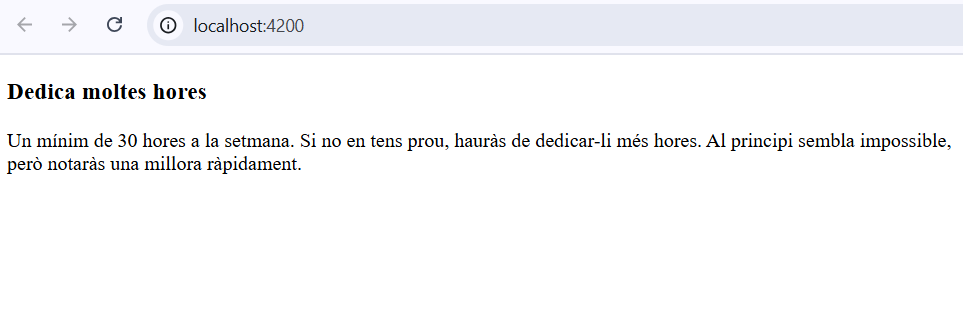
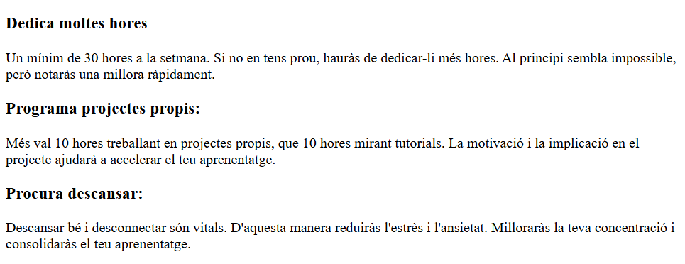
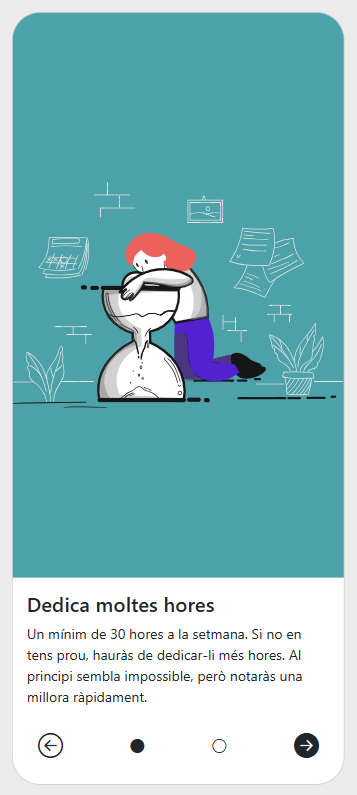

# IT-S5-Angular-OnBoarding

This project was generated using [Angular CLI](https://github.com/angular/angular-cli) version 20.0.3.

## Development server

To start a local development server, run:

```bash
ng serve
```

Once the server is running, open your browser and navigate to `http://localhost:4200/`. The application will automatically reload whenever you modify any of the source files.

## Code scaffolding

Angular CLI includes powerful code scaffolding tools. To generate a new component, run:

```bash
ng generate component component-name
```

For a complete list of available schematics (such as `components`, `directives`, or `pipes`), run:

```bash
ng generate --help
```

## Building

To build the project run:

```bash
ng build
```

This will compile your project and store the build artifacts in the `dist/` directory. By default, the production build optimizes your application for performance and speed.

## Running unit tests

To execute unit tests with the [Karma](https://karma-runner.github.io) test runner, use the following command:

```bash
ng test
```

## Running end-to-end tests

For end-to-end (e2e) testing, run:

```bash
ng e2e
```

Angular CLI does not come with an end-to-end testing framework by default. You can choose one that suits your needs.

## Additional Resources

For more information on using the Angular CLI, including detailed command references, visit the [Angular CLI Overview and Command Reference](https://angular.dev/tools/cli) page.


## 🗂️Tabla de contenidos

- [IT-S5-Angular-OnBoarding](#it-s5-angular-onboarding)
  - [Development server](#development-server)
  - [Code scaffolding](#code-scaffolding)
  - [Building](#building)
  - [Running unit tests](#running-unit-tests)
  - [Running end-to-end tests](#running-end-to-end-tests)
  - [Additional Resources](#additional-resources)
  - [🗂️Tabla de contenidos](#️tabla-de-contenidos)
  - [📄Descripción](#descripción)
    - [1. Mostrar texto del primer paso](#1-mostrar-texto-del-primer-paso)
    - [2. Añadir nuevos textos y mostrarlos en diferentes scenes](#2-añadir-nuevos-textos-y-mostrarlos-en-diferentes-scenes)
    - [3. Maquetación inicial responsive](#3-maquetación-inicial-responsive)
  - [💻Tecnologías Utilizadas](#tecnologías-utilizadas)
  - [📋Requisitos](#requisitos)
  - [🛠️Instalación](#️instalación)
    - [1. Descargar el repositorio](#1-descargar-el-repositorio)
    - [2. Instalación de paquetes Node.js](#2-instalación-de-paquetes-nodejs)
  - [▶️Ejecución](#️ejecución)

## 📄Descripción

Aplicación web en Angular que muestre un tutorial con los pasos a seguir para un onBoarding.

Se dibujan tarjetas con la información de cada paso y se puede ir hacia delante y atrás en ellas.

### 1. Mostrar texto del primer paso

- Crear los componentes `Home` y `Scene`.
- Crear interfaz `iStep`
- Crear servicio `Steps`
- Mostrar texto en la primera escena.



### 2. Añadir nuevos textos y mostrarlos en diferentes scenes

- Crear atributo `step` en `Scene`. Debe ser de tipo `iStep`.
- Añadirle `input()` para poder modificarlo externamente desde `Home`.
- Modificar impresión por pantalla de `Scene`.
- Añadir array de `iStep` en `Steps` con los datos proporcionados.
- Inyectar `Steps` en `Home` con `inject()`
- Pasar valor se step de `Home` a Scene.
- Recorrer e imprimir el listado de steps en `Home` mediante Scene.



### 3. Maquetación inicial responsive

- Crear tarjeta.
- Cargar imagen y fondo.
- Añadir botones.
- Distrubuir espacio de los elementos.



## 💻Tecnologías Utilizadas

- HTML
- SASS
- Typescript
- Angular

## 📋Requisitos

PENDIENTE COMPLETAR

- Navegador web
  
## 🛠️Instalación

PENDIENTE COMPLETAR

### 1. Descargar el repositorio

```shell
git clone https://github.com/soyjuandelgado/IT-S5-Angular-OnBoarding.git destino
```

### 2. Instalación de paquetes Node.js

```shell
npm install
```

## ▶️Ejecución

PENDIENTE

Visitar la web: [Web](https://soyjuandelgado.github.io/IT-S4-Typescript-API/)
